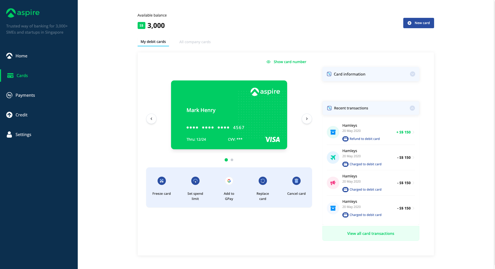
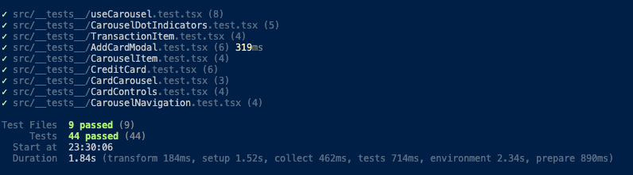

# Aspire Card Management Dashboard

A modern, responsive card management dashboard built with React, TypeScript, and Tailwind CSS. This application allows users to manage their debit cards, view transactions, and control card settings through an intuitive interface based on the Aspire brand design.





## Table of Contents

- [Features](#features)
- [Architecture](#architecture)
- [Design System](#design-system)
- [Component Structure](#component-structure)
- [State Management](#state-management)
- [Responsive Design](#responsive-design)
- [Testing](#testing)
- [Installation](#installation)
- [Usage](#usage)
- [Development](#development)
- [Future Improvements](#future-improvements)

## Features

- **Card Management**: View, add, and manage debit cards
- **Card Controls**: Freeze/unfreeze cards, set spending limits, and manage other card settings
- **Transaction History**: View detailed transaction history for each card
- **Secure Card Number Display**: Toggle visibility of card numbers for security
- **Responsive Design**: Optimized for both desktop and mobile experiences
- **Animated Card Carousel**: Smooth, interactive card navigation with keyboard support

## Architecture

The project follows a component-based architecture built on React and TypeScript, emphasizing reusability, maintainability, and performance.

### Core Architectural Patterns

1. **Component-Based Structure**: The UI is broken down into small, reusable components that can be composed to build complex interfaces.

2. **Context API for Global State**: The application uses React's Context API for managing global state related to cards.

3. **Custom Hooks**: Logic is abstracted into custom hooks to promote reusability and separation of concerns.

4. **Data Fetching with React Query**: Transaction data is fetched and cached using TanStack Query (React Query).

5. **Responsive Design**: The layout adapts to different screen sizes using Tailwind's responsive utilities and custom media queries.

6. **Memoization**: Performance-critical components use React.memo and useCallback to prevent unnecessary re-renders.

## Design System

The project uses a consistent design system based on Aspire's brand guidelines:

- **Color Palette**: 
  - Primary: Aspire Green (#01D167)
  - Secondary: Deep Blue (#325BAF)
  - Neutral shades for backgrounds and text
  - Accent colors for specific actions

- **Typography**: 
  - Open Sans as the primary font family
  - Consistent font sizes and weights across the application

- **Component Library**: 
  - Built on shadcn/ui components
  - Customized to match Aspire's design language

- **Iconography**: 
  - Uses Lucide icons for consistent iconography
  - Custom SVG icons for specific brand elements

## Component Structure

The application is organized into the following key components:

```
src/
├── components/         # UI components
│   ├── ui/             # Base UI components (shadcn)
│   ├── CardCarousel    # Card carousel with navigation
│   ├── CreditCard      # Card display component
│   ├── CardControls    # Card action buttons
│   ├── CardDetails     # Card information panel
│   ├── TransactionsList # Transactions history
│   └── ...
├── context/           # Global state management
│   └── CardContext    # Card state and operations
├── hooks/             # Custom React hooks
├── pages/             # Page components
├── services/          # API communication
└── assets/            # Static assets
```

## State Management

The application uses several approaches to state management:

1. **Local Component State**: For UI-specific state like form inputs, modal visibility, etc.

2. **Context API**: For sharing card data and operations across components:
   - Card information
   - Active card selection
   - Card operations (add, freeze, etc.)

3. **React Query**: For server state management including fetching and caching transaction data.

## Responsive Design

The dashboard is designed to work across devices with different approaches:

- **Mobile-First**: Core experience designed for mobile devices
- **Progressive Enhancement**: Additional features and layouts for larger screens
- **Adaptive Layout**: Different layouts for mobile vs. desktop (e.g., sidebar vs. bottom navigation)
- **Responsive Typography**: Font sizes adapt to viewport size
- **Touch-Optimized**: Mobile interactions optimized for touch (carousel, buttons)

### Card Carousel

The card carousel is a central feature with several complex behaviors:

- Smooth scrolling between cards with animation
- Touch/swipe support on mobile
- Arrow navigation and keyboard support
- Automatic "snap" to the nearest card
- Looping navigation (from last card to first)
- Visual feedback during transitions
- Debounced navigation to prevent rapid clicks

## Testing

The project includes comprehensive unit tests to ensure components work as expected:


- **Total Tests**: 44 unit tests across core components
- **Passed Tests**: 44/44 (100% pass rate)

Key tested components:
- Card Carousel and its sub-components (Navigation, Indicators, Items)
- Card Context and state management
- Transaction components
- Modal dialogs and user interactions

Tests are written using Vitest and React Testing Library, focusing on both component rendering and user interactions.

## Installation

```bash
# Clone the repository
git clone <repository-url>

# Navigate to the project directory
cd aspire-dashboard

# Install dependencies
npm install

# Start the development server
npm run dev
```

## Usage

After starting the development server, open your browser to http://localhost:5173 to see the application.

### Key User Flows

1. **View Cards**: Cards are displayed in a carousel on the dashboard
2. **Add Card**: Click the "New Card" button to add a new virtual card
3. **Show/Hide Card Details**: Toggle card number visibility for security
4. **Card Controls**: Access freeze, spending limits, and other card actions
5. **View Transactions**: See transaction history for the selected card

## Development

### Key Technologies

- **React 18+**: For building the UI
- **TypeScript**: For type safety
- **Tailwind CSS**: For styling
- **shadcn/ui**: For UI components
- **Vite**: For fast development and building
- **React Query**: For data fetching and caching
- **React Router**: For navigation

### Project Structure

- `/src/components`: Reusable UI components
- `/src/context`: Global state management
- `/src/hooks`: Custom React hooks
- `/src/pages`: Page components
- `/src/services`: API services
- `/src/assets`: Static assets like images and SVGs

## Future Improvements

- Enhanced transaction filtering and search
- Card spending analytics and charts
- Notification system for card activities
- Dark mode support
- E2E tests with Cypress
- Performance optimizations for large transaction lists

